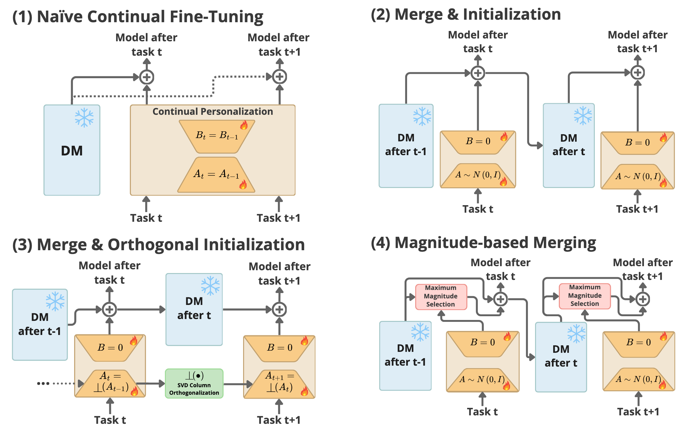

# <h1 align="center">Low-Rank Continual Personalization of Diffusion Models</h1>

<div align="center">

[](https://arxiv.org/abs/2410.04891)
</div>

<div align='center'>
<h3>Official code implementation of "Low-Rank Continual Personalization of Diffusion Models".</h3>
</div>

We propose to study the effectiveness of LoRA weights initialization and merging under the strict continual learning regime where only the model or model with a single adapter is passed between tasks. In a series of experiments, we compare (1) Naïve continual fine-tuning of the low-rank adapter, and three simple merging baselines mitigating forgetting of concepts and styles: (2) consecutive merging of task-specific adapters, (3) merging LoRAs initialized with orthogonal weights, and (4) merging through a selection of weights with the highest magnitude for the task. Our experiments indicate that adding multiple adapters in a Naïve way can lead to a situation where a model converges, in its performance, towards its base form, while all the evaluated techniques mitigate this issue.

<div align='center'>

</div>

## 🔥 Updates
- **[2025.02.16]** [Code](https://github.com/luk-st/continual-lora) released.
- **[2024.10.07]** Paper released on [arXiv](https://arxiv.org/abs/2410.04891).


## ⚙️ Environment setup
Create conda enviroment and activate it:
```bash
conda create -p <ENV_PATH> python=3.11
conda activate <ENV_PATH>
```

Install all dependencies:
```bash
pip install -r requirements.txt
```

**Note ⚠️** Change settings in the file: `python3.11/site-packages/diffusers/pipelines/pipeline_utils.py`, line ~278 (`DiffusionPipeline.save_pretrained()`):
```python
save_kwargs = {"max_shard_size": "15GB"}
```

## 📥 Download
#### CSD Model
Download model used for style metric:
```bash
pip install gdown
gdown 1FX0xs8p-C7Ob-h5Y4cUhTeOepHzXv_46
mv checkpoint.pth res/csd_checkpoint.pth
```

#### Style dataset
Download the [Unlearn Dataset](https://drive.google.com/drive/folders/1-1Sc8h_tGArZv5Y201ugTF0K0D_Xn2lM) and place it in the `/data/style_unlearn directory`.

To generate style datasets, run:
```bash
python3 preprocess/generate_style_dataset.py
```

#### Object dataset
Clone Dreambooth repo to `data/dreambooth` directory.
```bash
git clone https://github.com/google/dreambooth data/dreambooth
```

To generate object datasets, run:
```bash
python3 preprocess/generate_object_dataset.py
```

## 🚀 Models training

To train LoRA models for subjects and styles, run all experiments with different orders and object/style seeds:

```bash
sh slurm/run_all_objects.sh
sh slurm/run_all_styles.sh
```

To train a specific model for either objects or styles, use the following commands:
```bash
sbatch slurm/sbatch_train_obj.sh
sbatch slurm/sbatch_train_style.sh
```

## 🎨 Sampling

Run sampling for all trained object or style models:
```bash
sh slurm/run_sampling_all_objects.sh
sh slurm/run_sampling_all_styles.sh
```

## 📊 Evaluation
Evaluate all models (by default all style models):
```bash
sh slurm/run_eval.sh
```

## 📚 Citation
If you find this work useful, please cite:
```bibtex
@inproceedings{
      staniszewski2025lowrank,
      title={Low-Rank Continual Personalization of Diffusion Models},
      author={{\L}ukasz Staniszewski and Katarzyna Zaleska and Kamil Deja},
      booktitle={First Workshop on Scalable Optimization for Efficient and Adaptive Foundation Models},
      year={2025},
      url={https://openreview.net/forum?id=XsXhhq4Kvx}
}
```

## 🙏 Credits
The repository contains code from [task_vectors](https://github.com/mlfoundations/task_vectors), [magmax](https://github.com/danielm1405/magmax) and [diffusers](https://github.com/huggingface/diffusers).
